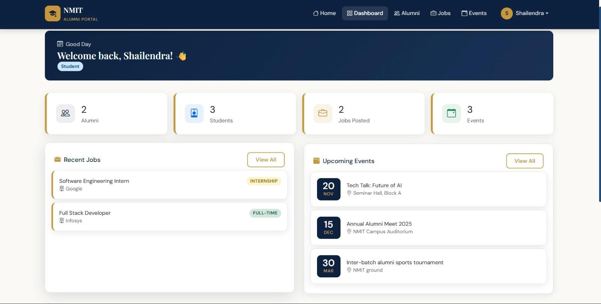

# 🎓 Alumni Portal

A modern **Flask-based Alumni Management System** that connects students, alumni, and administrators through a secure and user-friendly platform.


---

## ✨ Features

- 🔐 Secure Login & Registration
- 👨‍🎓 Alumni Profile Management
- 💼 Job & Internship Posting
- 📅 Event Management
- 📊 Dashboard
- 🔍 Search Functionality

---

## 🛠️ Tech Stack

- **Backend:** Python, Flask
- **Frontend:** HTML, CSS, JavaScript
- **Database:** SQLite

---

## 📂 Project Structure

```text
Alumni-portal/
├── static/
├── templates/
├── app.py
├── requirements.txt
└── README.md
```

---

## 🚀 Installation

```bash
git clone https://github.com/yourusername/Alumni-portal.git

cd Alumni-portal

pip install -r requirements.txt

python app.py
```

---

## 📸 Screenshots

## 📸 Dashboard



---

## 💼 Job Portal


---

## 👨‍💻 Author

**Ramesh Marathi**

📧 **Email:** rameshmarathi7765@gmail.com

💼 **LinkedIn:** https://www.linkedin.com/in/ramesh-marathi/

🐙 **GitHub:** https://github.com/rameshmarathi
